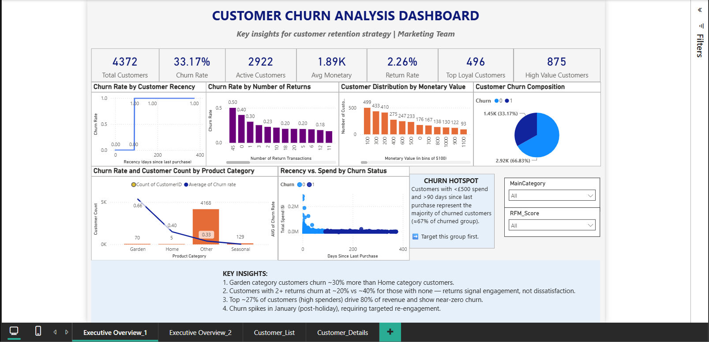
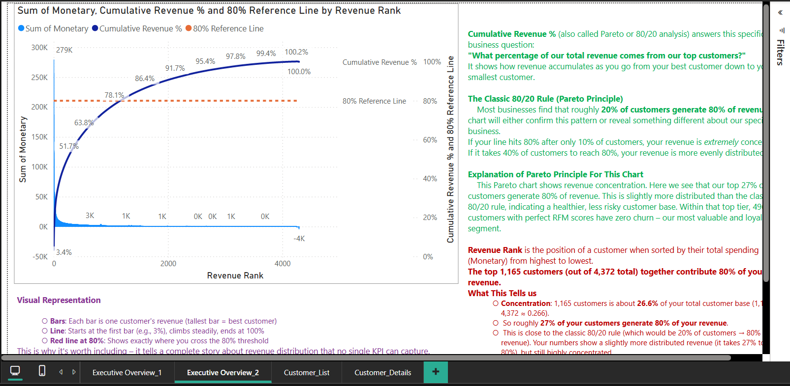
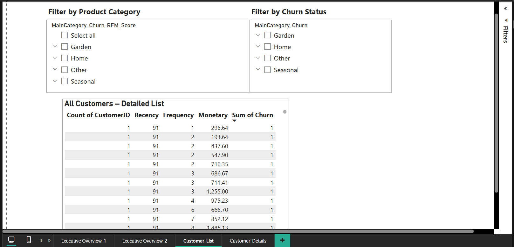

# Customer Churn Analysis for an E-commerce Retailer

## Project Overview
This project answers a real business question from the Head of Customer Experience:

**"Which customers are most likely to stop buying, and what can we do to retain them?"**

The marketing team needed a decision-ready tool to identify at-risk segments and design targeted retention campaigns.

## Dataset
- **Source:** UCI Online Retail Dataset (UK-based retailer, 2010-2011)
- **Size:** 541,909 transactions
- **Download Link:** [Online Retail Dataset](https://archive.ics.uci.edu/dataset/352/online+retail)

## Key Steps

### 1. Data Cleaning (Python)
- Removed 25% of rows with missing CustomerID
- Handled negative quantities (returns) and cancellations
- Created customer-level features: Recency, Frequency, Monetary (RFM)
- Defined churn as no purchase in the last 90 days

### 2. Analysis & Key Insights
- **Surprising finding:** Customers with 2+ returns churn at ~20% vs. ~40% for those with no returns. Returns signal engagement, not dissatisfaction.
- **Churn hotspot:** Customers with <$500 spend and >90 days inactivity represent ~60% of all churned customers.
- **Category insight:** Garden category churns 30% faster than Home.
- **Revenue concentration:** 27% of customers generate 80% of revenue (1,165 customers).

### 3. Power BI Dashboard
Built a three-page dashboard with:
- Executive Overview (KPI cards, churn drivers, pie chart, scatter plot)
- Pareto Chart (revenue concentration with 80% red line)
- Customer List with slicers and drillthrough to individual details

**Key DAX Measures:**
- Churn Rate
- High Value Customers (top 20% by spend)
- Top Loyal Customers (RFM 444 with zero churn) - 496 customers identified
- Cumulative Revenue % (for Pareto chart)

## Recommendations
1. Target the churn hotspot: customers with <$500 spend and >90 days inactivity
2. Launch seasonal discounts for Garden category (30% higher churn)
3. Investigate why no-return customers are 2x more likely to churn
4. Plan proactive January campaigns (post-holiday churn spike)

## Business Impact
- Provided marketing team with a filterable dashboard to isolate at-risk profiles
- Enables personalized retention actions without writing SQL
- Quantifies revenue concentration and loyal customer segments

## Tools Used
- Python (Pandas, Jupyter Notebook) - data cleaning and RFM engineering
- Power BI - interactive dashboard, DAX measures, Pareto chart
- Excel - initial data exploration

## Screenshots

## Author
Ahmad Obaidullah
[LinkedIn](www.linkedin.com/in/ahmad-obaidullah-a5a9391bb) | [GitHub](https://github.com/AhmadObyd89)

## License
This project is for portfolio purposes. Data is publicly available from UCI.

## Repository Structure
customer-churn-analysis-powerbi/
│
├── data/ # Raw and cleaned data (sample)
├── notebooks/ # Jupyter notebook with full cleaning and RFM
├── powerbi/ # .pbix file and exported images
├── docs/ # Executive summary PDF
├── screenshots/ # Dashboard screenshots
├── .gitignore # Ignore unnecessary files
└── README.md # This file
